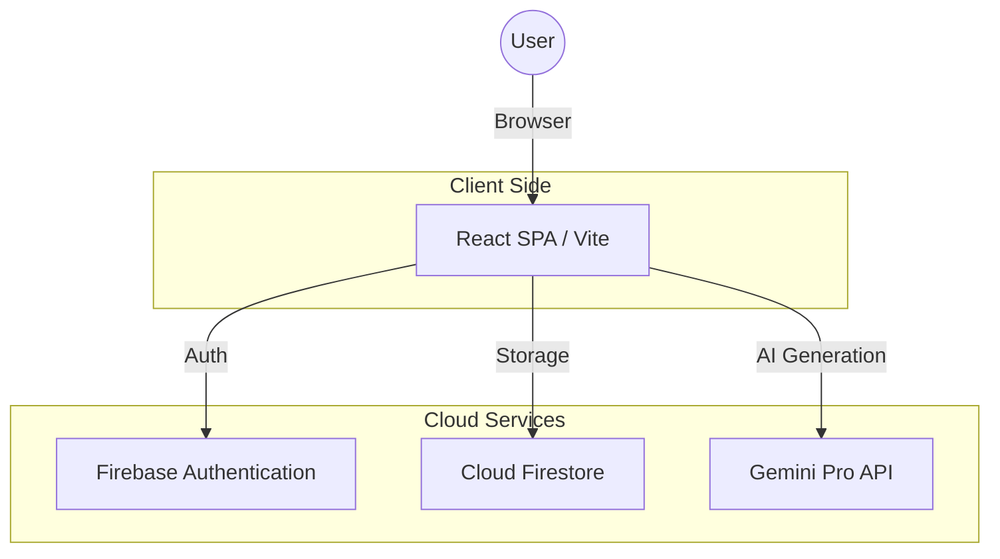

# SparkCopy: Web Dev Specification

## 📄 App Brief
SparkCopy is a high-performance AI copywriting tool designed specifically for e-commerce. It uses the Gemini Pro API to transform raw product features into persuasive, platform-optimized descriptions. The app supports multiple languages and maintains a persistent history for authenticated users.

## 👥 User Stories
- **Efficiency**: "As a Shopify store owner, I want to generate 10 descriptions in minutes so I can launch my collection faster."
- **Internationalization**: "As a global seller, I want to translate my product features into Spanish and German accurately to reach European markets."
- **Brand Consistency**: "As a marketing manager, I want to choose a 'Luxury' or 'Quirky' tone to match my brand's voice across all products."
- **Accessibility**: "As a late-night worker, I want a dark mode interface to reduce eye strain."
- **Organization**: "As a power user, I want to access my previous generations so I don't have to re-enter data for similar products."

## 🏗 Architecture Diagram

## 🗄 DB Schema Draft (Firestore)
**Collection: `descriptions`**
| Field | Type | Description |
| :--- | :--- | :--- |
| `userId` | string | Reference to Auth UID |
| `name` | string | Product name |
| `features` | string | Raw specs/features provided by user |
| `targetAudience` | string | Intended customer base |
| `tone` | string | Tone of voice (Professional, Luxury, etc.) |
| `platform` | string | Target platform (Amazon, Instagram, etc.) |
| `language` | string | Output language |
| `customInstructions`| string | Optional user-specific directions |
| `content` | string | The final AI-generated text |
| `createdAt` | timestamp | Server-side generation time |

## 🎨 Wireframe Overview
- **Layout**: Adaptive two-column dashboard.
- **Input Side**: Clean vertical form with segmented controls for Tone and Platform.
- **Output Side**: High-contrast "Terminal" style block for AI text with immediate Copy/Share actions.
- **Navigation**: Sticky top bar with instant theme switching and profile management.
